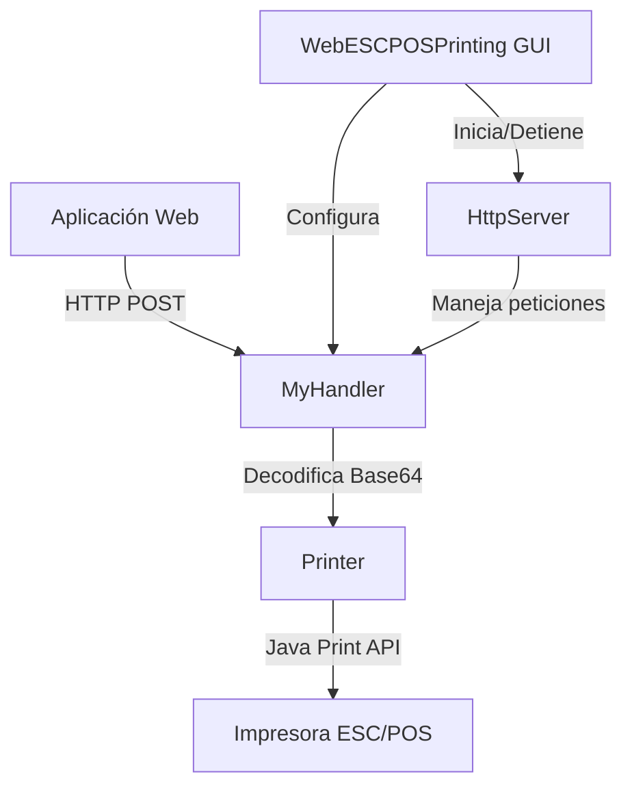

# WebESCPOSPrint

[](https://www.oracle.com/java/)
[](LICENSE)
[]()

**WebESCPOSPrint** es una aplicación Java de escritorio que actúa como puente entre aplicaciones web y impresoras ESC/POS, permitiendo la impresión directa desde navegadores web a través de un servidor HTTP local.

> **Nota**: Este proyecto está basado en una implementación original desarrollada en .NET por **Oliver Chan**. Esta versión Java mantiene la funcionalidad core mientras añade mejoras específicas para el ecosistema Java.

## 📋 Tabla de Contenidos

- [Características](#-características)
- [Casos de Uso](#-casos-de-uso)
- [Requisitos](#-requisitos)
- [Instalación](#-instalación)
- [Uso](#-uso)
- [API HTTP](#-api-http)
- [Configuración](#-configuración)
- [Desarrollo](#-desarrollo)
- [Contribuir](#-contribuir)
- [Licencia](#-licencia)

## ✨ Características

- **🖨️ Detección Automática de Impresoras**: Identifica y lista todas las impresoras ESC/POS conectadas
- **🌐 Servidor HTTP Local**: Recibe comandos de impresión desde aplicaciones web
- **🔧 Interfaz Gráfica Simple**: Configuración fácil a través de una GUI intuitiva
- **💾 Persistencia de Configuración**: Guarda automáticamente las preferencias del usuario
- **🔄 Auto-inicio**: Inicia automáticamente el servidor si hay impresoras disponibles
- **📱 Bandeja del Sistema**: Ejecuta minimizado en la bandeja del sistema
- **🌍 Soporte CORS**: Compatible con peticiones desde navegadores web
- **📝 Comandos ESC/POS**: Soporte completo para comandos de impresora ESC/POS

## 🎯 Casos de Uso

- **Puntos de Venta (POS)**: Sistemas de venta basados en web que requieren impresión de tickets
- **Aplicaciones de Delivery**: Impresión de órdenes desde plataformas web de comida
- **Sistemas de Facturación**: Impresión directa de facturas y recibos
- **Aplicaciones de Inventario**: Impresión de etiquetas y códigos de barras
- **Kioscos Interactivos**: Sistemas web que necesitan capacidades de impresión local

## 📋 Requisitos

### Requisitos del Sistema
- **Java Runtime Environment (JRE) 8 o superior**
- **Sistema Operativo**: Windows, Linux, o macOS
- **Impresora ESC/POS** conectada y configurada en el sistema

### Requisitos de Red
- **Puerto TCP disponible** (por defecto: 8779)
- **Permisos de firewall** para el puerto seleccionado

## 🚀 Instalación

### Opción 1: Ejecutar desde JAR (Recomendado)

1. Descarga el archivo `WebESCPOSPrinting.jar` desde [Releases](../../releases)
2. Asegúrate de tener Java 8+ instalado
3. Ejecuta la aplicación:
   ```bash
   java -jar WebESCPOSPrinting.jar
   ```

### Opción 2: Compilar desde Código Fuente

1. **Clonar el repositorio**:
   ```bash
   git clone https://github.com/tu-usuario/webescposprint.git
   cd webescposprint
   ```

2. **Compilar con Apache Ant**:
   ```bash
   ant clean
   ant jar
   ```

3. **Ejecutar**:
   ```bash
   java -jar dist/WebESCPOSPrinting.jar
   ```

### Opción 3: Desarrollo con NetBeans

1. Abre NetBeans IDE
2. Importa el proyecto desde el directorio clonado
3. Ejecuta directamente desde el IDE

## 🖥️ Uso

### Configuración Inicial

1. **Inicia la aplicación**
2. **Selecciona una impresora** de la lista desplegable
3. **Configura el puerto HTTP** (por defecto: 8779)
4. **Haz clic en "Establecer"** para guardar la configuración
5. **Inicia el servidor** con el botón "Iniciar"

### Interfaz de Usuario

```
┌─────────────────────────────────────┐
│ Seleccione Impresora                │
├─────────────────────────────────────┤
│ Instaladas: [Dropdown List]         │
│ Puerto: [8779]        [Establecer]  │
│                                     │
│ Impresora seleccionada: [Nombre]    │
│ Puerto seleccionado: [8779]         │
└─────────────────────────────────────┘
┌─────────────────────────────────────┐
│ Estado del Servidor                 │
├─────────────────────────────────────┤
│ [Iniciar] [Detener] [●●● Loading]   │
└─────────────────────────────────────┘
```

### Estados del Servidor

- **🟢 Iniciado**: El servidor está ejecutándose y listo para recibir peticiones
- **🔴 Detenido**: El servidor está parado
- **🟡 Iniciando**: El servidor está en proceso de inicio

## 🌐 API HTTP

### Endpoint de Impresión

```http
POST http://localhost:8779/print
Content-Type: text/plain
```

### Formato de Datos

Los datos deben enviarse **codificados en Base64** y **formato ASCII**:

```javascript
// Ejemplo en JavaScript
const printData = "Tu texto o comandos ESC/POS aquí";
const base64Data = btoa(printData);

fetch('http://localhost:8779/print', {
    method: 'POST',
    headers: {
        'Content-Type': 'text/plain',
    },
    body: base64Data
})
.then(response => response.text())
.then(data => console.log('Respuesta:', data))
.catch(error => console.error('Error:', error));
```

### Ejemplo con Comandos ESC/POS

```javascript
// Comandos ESC/POS para ticket
const escCommands = 
    "\x1B\x40" +           // Inicializar impresora
    "\x1B\x61\x01" +       // Centrar texto
    "NOMBRE DEL NEGOCIO\n" +
    "\x1B\x61\x00" +       // Alinear izquierda
    "Producto: Cafe\n" +
    "Precio: $5.00\n" +
    "\x1B\x64\x03" +       // Avanzar 3 líneas
    "\x1D\x56\x41";        // Cortar papel

const base64Commands = btoa(escCommands);

fetch('http://localhost:8779/print', {
    method: 'POST',
    body: base64Commands
});
```

### Respuestas de la API

| Código | Respuesta | Descripción |
|--------|-----------|-------------|
| 200 | "Recibido correctamente" | Comando enviado exitosamente a la impresora |
| Error | Mensaje de error | Error en el proceso de impresión |

## ⚙️ Configuración

### Configuración Avanzada

La aplicación guarda las siguientes preferencias automáticamente:

- **Impresora por defecto**: `impresoraDefault`
- **Puerto por defecto**: `puertoDefault` (8779)

### Archivos de Configuración

Las preferencias se almacenan en:
- **Windows**: `HKEY_CURRENT_USER\Software\JavaSoft\Prefs\webescposprinting`
- **Linux/macOS**: `~/.java/.userPrefs/webescposprinting`

### Solución de Problemas

#### Problema: No se detectan impresoras
**Solución**: 
- Verifica que la impresora esté conectada y encendida
- Asegúrate de que los drivers estén instalados
- Reinicia la aplicación

#### Problema: Puerto en uso
**Solución**:
- Cambia a un puerto diferente (8780, 8781, etc.)
- Verifica que no haya otra instancia ejecutándose
- Comprueba que el firewall no bloquee el puerto

#### Problema: Error de impresión
**Solución**:
- Verifica que la impresora esté en línea
- Revisa que haya papel en la impresora
- Comprueba los comandos ESC/POS enviados

## 🛠️ Desarrollo

### Estructura del Proyecto

```
webescposprint/
├── src/
│   ├── webescposprinting/
│   │   ├── WebESCPOSPrinting.java    # Clase principal y GUI
│   │   ├── MyHandler.java            # Manejador HTTP
│   │   ├── Printer.java              # Motor de impresión
│   │   └── Caster.java               # Utilidades
│   └── recursos/                     # Recursos gráficos
├── build/                            # Archivos compilados
├── dist/                             # JAR de distribución
├── nbproject/                        # Configuración NetBeans
└── build.xml                         # Script de construcción Ant
```

### Compilación

```bash
# Limpiar proyecto
ant clean

# Compilar
ant compile

# Generar JAR
ant jar

# Construcción completa
ant clean jar
```

### Arquitectura



## 🤝 Contribuir

¡Las contribuciones son bienvenidas! Por favor:

1. **Fork** el proyecto
2. **Crea** una rama para tu feature (`git checkout -b feature/AmazingFeature`)
3. **Commit** tus cambios (`git commit -m 'Add some AmazingFeature'`)
4. **Push** a la rama (`git push origin feature/AmazingFeature`)
5. **Abre** un Pull Request

### Guías de Contribución

- Mantén el código limpio y bien documentado
- Añade tests para nuevas funcionalidades
- Sigue las convenciones de naming existentes
- Actualiza la documentación según corresponda

## 📝 Licencia

Este proyecto está licenciado bajo la Licencia MIT - ver el archivo [LICENSE](LICENSE) para más detalles.

## 📧 Contacto

**Desarrollador**: Jesús Espinoza  
**Email**: [tu-email@ejemplo.com]  
**Proyecto**: [https://github.com/tu-usuario/webescposprint](https://github.com/tu-usuario/webescposprint)

**Proyecto Original (.NET)**: Desarrollado por Oliver Chan

## 📋 Historial del Proyecto

Este proyecto Java es una adaptación del concepto original desarrollado por **Oliver Chan** en .NET. Mientras que el proyecto original demostró la viabilidad de la solución para impresión web-to-ESC/POS, esta implementación Java aporta:

- **Multiplataforma**: Compatible con Windows, Linux y macOS
- **Interfaz Gráfica Mejorada**: GUI más intuitiva con Swing
- **Persistencia de Configuración**: Usando Java Preferences API
- **Mejor Manejo de Errores**: Sistema robusto de validaciones
- **Soporte de Bandeja del Sistema**: Ejecución en background

## 🙏 Agradecimientos

- **Oliver Chan** por el proyecto original desarrollado en .NET que sirvió como base e inspiración para esta implementación Java
- Comunidad Java por las librerías utilizadas
- Desarrolladores de impresoras ESC/POS por la documentación
- Contribuidores del proyecto

---

⭐ **¡Si este proyecto te fue útil, por favor dale una estrella!** ⭐